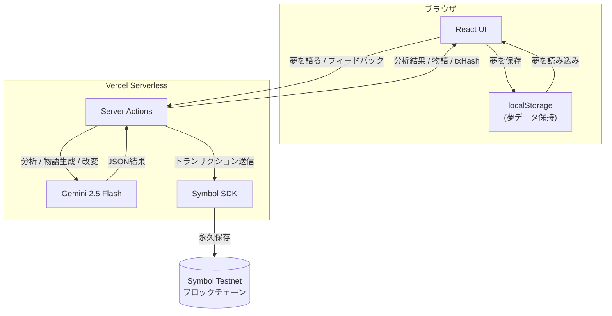
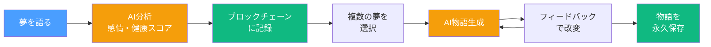

# Dream Story

夢を語り、分析し、物語に変換し、ブロックチェーンに永久保存するアプリ。

**Live Demo**: https://dream-story-roan.vercel.app

## 機能

- **夢語りチャット** - AIと会話しながら夢の内容を引き出す
- **夢分析** - 感情分析（ストレス・不安・喜び）と健康スコアを算出
- **物語生成** - 複数の夢を素材に、AIが実験的な短編小説を創作。フィードバックで物語を磨ける
- **ブロックチェーン記録** - 夢と物語をSymbol Testnetに永久保存。物語には元の夢のtxHashを埋め込み、来歴（プロヴェナンス）を証明

## 技術スタック

- **フロントエンド**: Next.js 16 / React 19 / TypeScript / Tailwind CSS 4
- **AI**: Google Gemini 2.5 Flash
- **ブロックチェーン**: Symbol Testnet
- **バリデーション**: Zod
- **デプロイ**: Vercel

## セットアップ

### 前提条件

- Node.js 18+
- npm

### インストール

```bash
git clone https://github.com/NarumiKomaba/dream-story.git
cd dream-story
npm install
```

### 環境変数

`.env.local` を作成して以下を設定:

```
GEMINI_API_KEY=your_gemini_api_key
SYMBOL_PRIVATE_KEY=your_symbol_testnet_private_key
SYMBOL_NODE_URL=https://sym-test-01.opening-line.jp:3001
```

### 起動

```bash
npm run dev
```

http://localhost:3000 をブラウザで開く。

## アーキテクチャ

### システム構成図



### ユーザーフロー



### ディレクトリ構成

```
src/
  app/
    page.tsx          # 夢語りチャット（メインページ）
    story/page.tsx    # 物語生成ページ
    stories/page.tsx  # 物語一覧ページ
    actions.ts        # Server Actions（AI呼び出し・ブロックチェーン記録）
  services/
    ai.ts             # Gemini AI サービス（分析・物語生成・改変）
    dreamStore.ts     # サーバー側データ永続化
    clientDreamStore.ts # クライアント側localStorage永続化
  types/
    dream.ts          # 型定義・Zodスキーマ
  components/
    Header.tsx        # 共通ヘッダー
```

## ライセンス

MIT
