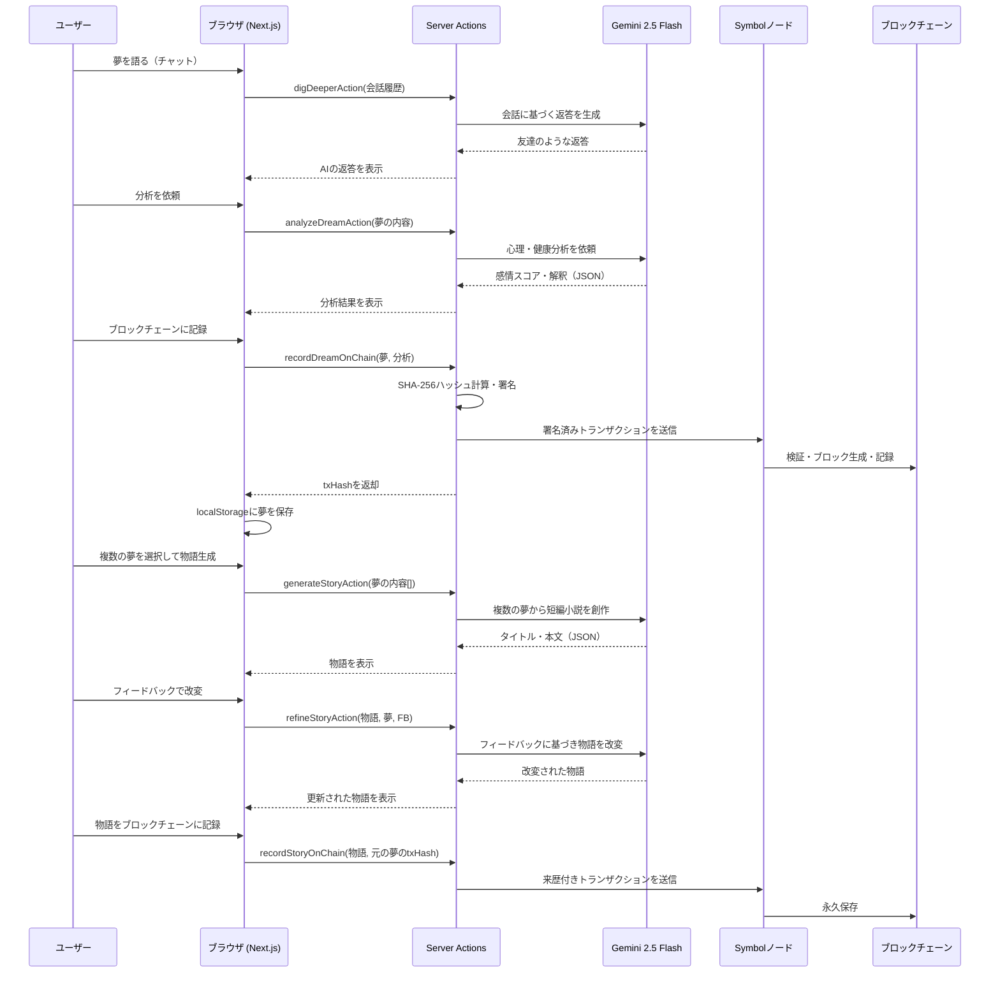

# Dream Story

夢を語り、分析し、物語に変換し、ブロックチェーンに永久保存する dApp

**デモサイト**: https://dream-story-roan.vercel.app

**動画デモ**: https://youtube.com/shorts/eQF9Rldwv7Q

## 概要

Dream Story は、AIと会話しながら夢を記録・分析し、複数の夢を素材に実験的な短編小説を創作、ブロックチェーンに永久保存するアプリです。

- AIが聞き役となり、夢の内容を自然な会話で引き出す
- 感情分析（ストレス・不安・喜び）と健康スコアで夢を可視化
- 複数の夢を組み合わせて一つの文学作品に昇華。フィードバックで物語を磨ける
- 夢と物語のハッシュを Symbol Testnet に記録し、来歴（プロヴェナンス）を証明

## 技術スタック

| レイヤー | 技術 |
|:---|:---|
| ブロックチェーン | Symbol (NEM) Testnet |
| フロントエンド | Next.js 16, React 19, TypeScript, Tailwind CSS 4 |
| AI | Google Gemini 2.5 Flash (夢分析・物語生成・改変) |
| バリデーション | Zod (入力検証・AIレスポンス検証) |
| 端末内保存 | localStorage (夢データのブラウザ保持) |
| ホスティング | Vercel |

## アーキテクチャ

### システム構成図


### シーケンス図


## セットアップ

### 必要なもの

- Node.js 18+
- Gemini API キー
- Symbol Testnet アカウント（トランザクション手数料用の XYM が必要）

### インストール

```bash
# リポジトリのクローン
git clone https://github.com/NarumiKomaba/dream-story.git
cd dream-story

# 依存パッケージのインストール
npm install

# 環境変数ファイルの作成
cp .env.local.example .env.local
# .env.local を編集

# 開発サーバーの起動
npm run dev
```

ブラウザで http://localhost:3000 を開いてください。

### 環境変数

| 変数名 | 説明 | 必須 |
|:---|:---|:---|
| `GEMINI_API_KEY` | Google Gemini API キー | はい |
| `SYMBOL_PRIVATE_KEY` | Symbol Testnet の秘密鍵（64文字の16進数） | はい |
| `SYMBOL_NODE_URL` | Symbol ノードのエンドポイント | いいえ（デフォルト: `https://sym-test-01.opening-line.jp:3001`） |

### ビルド

```bash
npm run build
npm run start
```

## 使い方

1. **夢を語る**: AIとチャットしながら夢の内容を話す。AIが友達のように相槌を打つ
2. **分析する**: 会話がある程度進んだら「分析」ボタンで感情分析・健康スコアを取得
3. **記録する**: 分析結果とともに夢のハッシュを Symbol Testnet に永久保存
4. **物語を紡ぐ**: 「物語」ページで記録済みの夢を2〜5個選び、AIが短編小説を創作
5. **磨く**: フィードバックを送ると物語が改変される。納得いくまで繰り返せる
6. **永久保存**: 完成した物語を元の夢のtxHash付きでブロックチェーンに記録

### トランザクションの構造

| 項目 | 値 | 意味 |
|:---|:---|:---|
| 送信者 (Signer) | サーバーアカウント | 誰が記録を提出したか |
| 受信者 (Recipient) | 自分宛て | トランザクション履歴に残すため |
| メッセージ (Message) | コンテンツの SHA-256 ハッシュ + メタデータ | 夢/物語のデジタル指紋 |
| 手数料 (Fee) | 最小限の XYM | ネットワーク手数料 |
| タイムスタンプ | ブロック生成時刻 | いつ記録が刻まれたか |

## プロジェクト構成

```
src/
  app/
    page.tsx              # 夢語りチャット（メインページ）
    story/page.tsx        # 物語生成・フィードバック・保存ページ
    stories/page.tsx      # 保存済み物語の一覧ページ
    actions.ts            # Server Actions（AI呼び出し・ブロックチェーン記録）
  services/
    ai.ts                 # Gemini AI サービス（分析・物語生成・改変）
    dreamStore.ts         # サーバー側データ永続化
    clientDreamStore.ts   # localStorage による夢データのブラウザ保持
  types/
    dream.ts              # 型定義・Zodスキーマ
  components/
    Header.tsx            # 共通ナビゲーションヘッダー
```

## セキュリティ

- 秘密鍵はサーバー側の環境変数にのみ保持し、クライアントには一切送信しない
- すべてのユーザー入力・AIレスポンスを Zod スキーマで検証
- 記録された証明はパブリックブロックチェーン上で誰でも独立して検証可能

## ライセンス

MIT
